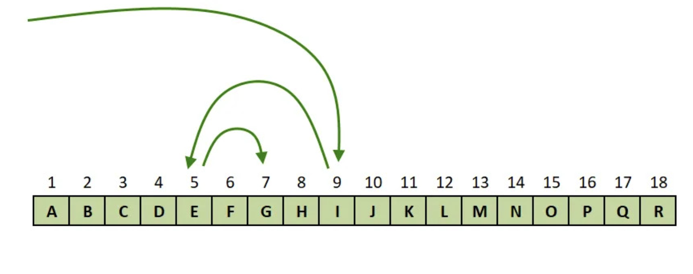

# ⚡ Lighting talk

How to find the commit that broke your feature: 
`git bisect`

---

# 🔧 How does it work..?

It uses a binary search to traverse a commit tree, to find the culprit commit.

- Either manual, by using `good` or `bad`
- By running a automated tes
<br />




---

# 🤖 How do I run it..?

```
git bisect start
git bisect bad <commit>
git bisect good <commit>
```

<br>

##### Or if you want to get fancy:
```
git bisect run npm run test:e2e
```

---

# 🧑‍💻 Demo time!

```
git bisect good 40c4621
```